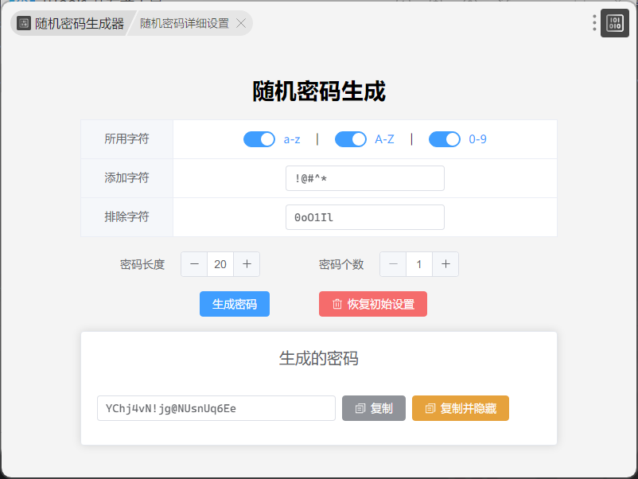
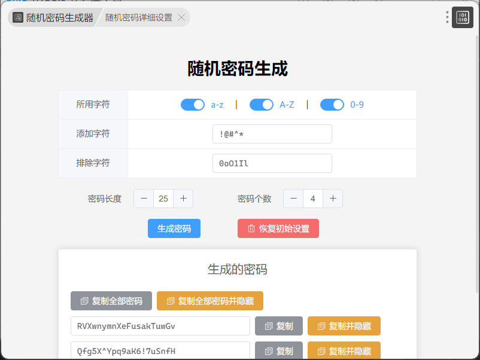
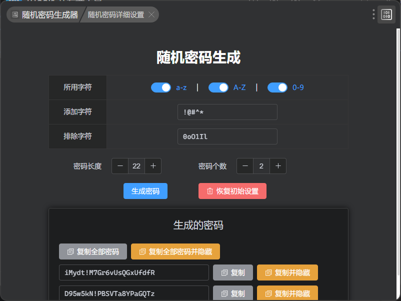

# 随机密码生成器

## 介绍

一个简单的随机密码生成器，可以生成包含大写字母、小写字母、数字和特殊字符的密码。

## 特性

- 生成包含自定义字符集（大写字母、小写字母、数字、特殊字符）的密码。
- 指定密码的长度和生成的密码数量。
- 将生成的密码复制到剪贴板。
- 重置选项为默认设置。
- 根据系统设置自动检测并应用暗模式。

## 截图

### 单个密码生成

  

### 自动复制密码

  

### 多个密码生成

  

### 深色模式演示

## 配置

### TypeScript 配置

`tsconfig.json` 文件包含以下设置：
- `module`: `commonjs`
- `target`: `ES2016`
- `sourceMap`: `true`
- `types`: `["utools-api-types"]`
- `exclude`: `["node_modules"]`
- `include`: `["src/**/*.vue", "src/**/*.js", "src/**/*.ts"]`

### Vite 配置

`vite.config.js` 文件包含以下插件：
- `@vitejs/plugin-vue`
- `unplugin-auto-import/vite`
- `unplugin-vue-components/vite`
- `unplugin-icons/vite`

## 项目结构

- `src/main.js`: 应用程序的入口点。
- `src/App.vue`: 主应用组件。
- `src/js/storage.js`: 用于存储和检索选项的实用函数。
- `src/js/generatefun.js`: 用于生成密码的函数。